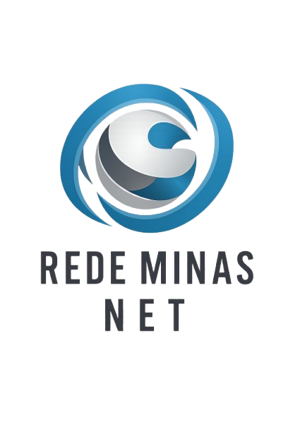

<!DOCTYPE html>
<html lang="pt-BR">
<head>
    <meta charset="UTF-8">
    <meta name="viewport" content="width=device-width, initial-scale=1.0">
    <title>Rede Minas Net - Internet Rápida e Estável de Verdade</title>
    <!-- Google Fonts: Inter -->
    <link rel="preconnect" href="https://fonts.googleapis.com">
    <link rel="preconnect" href="https://fonts.gstatic.com" crossorigin>
    <link href="https://fonts.googleapis.com/css2?family=Inter:wght@300;400;600;700;800&display=swap" rel="stylesheet">
    <!-- Font Awesome for Icons -->
    <link rel="stylesheet" href="https://cdnjs.cloudflare.com/ajax/libs/font-awesome/6.4.0/css/all.min.css">
    
    
</head>
<body>

    <!-- Header -->
    <header>
        

            <!-- A imagem da logo fornecida será carregada aqui -->
            
        

        <nav>
            
<i class="fas fa-bars"></i>

            <ul id="nav-list">
                <li><a href="#beneficios">Benefícios</a></li>
                <li><a href="#cobertura">Cobertura</a></li>
                <li><a href="#planos">Planos</a></li>
                <li><a href="#como-funciona">Como Funciona</a></li>
            </ul>
        </nav>
    </header>

    <!-- Hero Section -->
    <section class="hero" id="inicio">
        

            <h1>Internet rápida e estável de verdade</h1>
            
Conexão confiável para sua casa ou empresa, sem dor de cabeça.

            
            

                <i class="fas fa-check-circle"></i> Consulte disponibilidade para sua rua
                <i class="fas fa-bolt"></i> Atendimento rápido via WhatsApp
            

            
            <a href="https://wa.me/5535998252502?text=Olá,%20gostaria%20de%20consultar%20a%20disponibilidade%20de%20internet%20para%20minha%20rua!" class="btn" target="_blank">
                <i class="fab fa-whatsapp"></i> Falar no WhatsApp
            </a>
        

    </section>

    <!-- Benefícios -->
    <section id="beneficios" class="light-bg">
        <h2 class="section-title hidden">Por que escolher a Rede Minas Net?</h2>
        
A tecnologia que você precisa com o respeito que você merece.

        
        

            

                <i class="fas fa-network-wired"></i>
                <h3>Fibra Óptica</h3>
                
Tecnologia de ponta ponta a ponta para garantir a melhor transmissão de dados.

            

            

                <i class="fas fa-tachometer-alt"></i>
                <h3>Alta Velocidade</h3>
                
Velocidade real entregue, ideal para streaming, jogos e home office.

            

            

                <i class="fas fa-shield-alt"></i>
                <h3>Estabilidade</h3>
                
Conexão contínua sem quedas ou interrupções nos momentos em que você mais precisa.

            

            

                <i class="fas fa-headset"></i>
                <h3>Atendimento Rápido</h3>
                
Suporte ágil e humanizado diretamente pelo WhatsApp.

            

        

    </section>

    <!-- Diferenciais -->
    <section id="diferenciais">
        <h2 class="section-title hidden">Nossos Diferenciais</h2>
        
Muito além de apenas uma conexão de internet.

        
        

            

                <i class="fas fa-user-friends"></i>
                <h3>Atendimento Humanizado</h3>
                
Fale com pessoas reais, não com robôs. Entendemos e resolvemos seu problema.

            

            

                <i class="fas fa-map-marker-alt"></i>
                <h3>Empresa Regional</h3>
                
Conhecemos a região e estamos perto de você para qualquer eventualidade.

            

            

                <i class="fas fa-anchor"></i>
                <h3>Foco em Estabilidade</h3>
                
Nossa rede é projetada para manter você conectado o tempo todo.

            

            

                <i class="fab fa-whatsapp"></i>
                <h3>Suporte Ágil via WhatsApp</h3>
                
Abra chamados, tire dúvidas e resolva pendências direto do seu celular.

            

        

    </section>

    <!-- Cobertura -->
    <section id="cobertura" class="cobertura">
        <h2 class="section-title hidden">Onde Estamos</h2>
        
Atendendo sua região com qualidade e proximidade.

        
        

            
<i class="fas fa-map-pin"></i> Campo Belo - MG

            
<i class="fas fa-map-pin"></i> Santana do Jacaré - MG

            
<i class="fas fa-map-pin"></i> Candeias - MG

            
<i class="fas fa-tractor"></i> Zonas Rurais

        

    </section>

    <!-- Planos -->
    <section id="planos" class="light-bg">
        <h2 class="section-title hidden">Escolha seu Plano Ideal</h2>
        
Navegue sem limites com nossa fibra óptica.

        
        

            
            <!-- Plano 1 -->
            

                
350 MEGA

                
Ideal para navegação diária, redes sociais e vídeos em HD.

                <a href="https://wa.me/5535998252502?text=Gostaria%20de%20saber%20a%20disponibilidade%20do%20plano%20de%20350%20MEGA!" class="btn" target="_blank">Consultar disponibilidade</a>
            

            <!-- Plano 2 -->
            

                
450 MEGA

                
Perfeito para famílias, streaming 4K e downloads rápidos.

                <a href="https://wa.me/5535998252502?text=Gostaria%20de%20saber%20a%20disponibilidade%20do%20plano%20de%20450%20MEGA!" class="btn" target="_blank">Consultar disponibilidade</a>
            

            <!-- Plano 3 (Destaque) -->
            

                
Mais Contratado

                
620 MEGA

                
Alta performance para home office, jogos online e múltiplos dispositivos.

                <a href="https://wa.me/5535998252502?text=Gostaria%20de%20saber%20a%20disponibilidade%20do%20plano%20de%20620%20MEGA!" class="btn" target="_blank">Consultar disponibilidade</a>
            

            <!-- Plano 4 -->
            

                
750 MEGA

                
Velocidade extrema para usuários exigentes e criadores de conteúdo.

                <a href="https://wa.me/5535998252502?text=Gostaria%20de%20saber%20a%20disponibilidade%20do%20plano%20de%20750%20MEGA!" class="btn" target="_blank">Consultar disponibilidade</a>
            

            <!-- Plano 5 -->
            

                
900 MEGA

                
A experiência máxima de conectividade. O melhor da fibra óptica.

                <a href="https://wa.me/5535998252502?text=Gostaria%20de%20saber%20a%20disponibilidade%20do%20plano%20de%20900%20MEGA!" class="btn" target="_blank">Consultar disponibilidade</a>
            

        

    </section>

    <!-- Como Funciona -->
    <section id="como-funciona">
        <h2 class="section-title hidden">Como Funciona</h2>
        
Três passos simples para você ter a melhor internet.

        
        

            

                
1

                <h3>Chame no WhatsApp</h3>
                
Clique em qualquer botão do site e fale diretamente com nossa equipe.

            

            

                
2

                <h3>Consulte Disponibilidade</h3>
                
Envie seu endereço e verificamos a viabilidade para sua rua na hora.

            

            

                
3

                <h3>Agende sua Instalação</h3>
                
Tudo certo? Agendamos o melhor horário para instalar sua nova internet.

            

        

    </section>

    <!-- Prova Social -->
    <section id="prova-social" class="light-bg">
        <h2 class="section-title hidden">O que dizem nossos clientes</h2>
        
A satisfação de quem já navega em alta velocidade.

        
        

            

                <i class="fas fa-quote-left"></i>
                
"Finalmente achei uma internet que não cai quando chove. O suporte deles pelo WhatsApp é fantástico e resolve na hora!"

                

                    
M

                    

                        <h4>Marcelo Silva</h4>
                        Campo Belo - MG
                    

                

            

            

                <i class="fas fa-quote-left"></i>
                
"Trabalho em home office e precisava de estabilidade. O plano de 620 Mega me atende perfeitamente. Super recomendo a Rede Minas Net."

                

                    
A

                    

                        <h4>Aline Costa</h4>
                        Santana do Jacaré - MG
                    

                

            

            

                <i class="fas fa-quote-left"></i>
                
"Mesmo morando na zona rural, a conexão chega com ótima qualidade. Instalação rápida e equipe muito educada."

                

                    
R

                    

                        <h4>Roberto Nunes</h4>
                        Zona Rural
                    

                

            

        

    </section>

    <!-- Final CTA -->
    <section class="final-cta">
        

            <h2>Pare de sofrer com internet instável.</h2>
            
Consulte disponibilidade para sua rua agora mesmo e faça a mudança que sua casa merece.

            <a href="https://wa.me/5535998252502?text=Olá,%20quero%20parar%20de%20sofrer%20com%20internet%20ruim.%20Podem%20verificar%20a%20disponibilidade%20para%20mim?" class="btn" target="_blank" style="font-size: 1.3rem; padding: 20px 40px;">
                <i class="fab fa-whatsapp"></i> Falar com atendente agora
            </a>
        

    </section>

    <!-- Footer -->
    <footer>
        

            
        

        

            
Rede Minas Net - Provedor de Internet Fibra Óptica

            
Campo Belo | Santana do Jacaré | Candeias | Zonas Rurais

            
<i class="fab fa-whatsapp"></i> (35) 99825-2502

        

        

            
&copy; 2026 Rede Minas Net. Todos os direitos reservados.

        

    </footer>

    <!-- Botão Flutuante WhatsApp -->
    <a href="https://wa.me/5535998252502?text=Olá,%20gostaria%20de%20consultar%20a%20disponibilidade%20de%20internet!" class="whatsapp-float pulse" target="_blank">
        <i class="fab fa-whatsapp"></i>
    </a>

    <!-- Scripts -->
    
</body>
</html>
